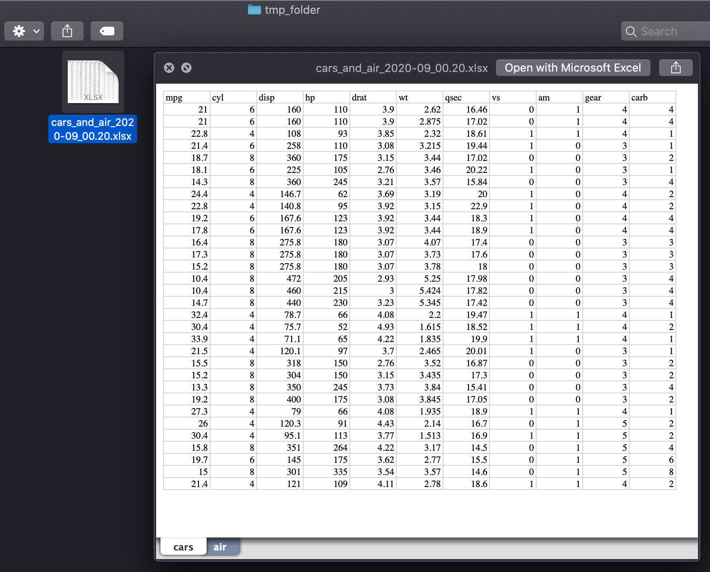

<!-- README.md is generated from README.Rmd. Please edit that file -->

```{r, include = FALSE}
knitr::opts_chunk$set(
  collapse = TRUE,
  comment = "#>",
  fig.path = "man/figures/README-",
  out.width = "100%"
)
```

# xlreports

<!-- badges: start -->
<!-- badges: end -->

The goal of xlreports is to create simple wrappers around the writexl::write_xlsx function that
makes it easier to export data frames into timestamped Excel files.

## Installation

<!-- You can install the released version of xlreports from [CRAN](https://CRAN.R-project.org) with:

``` r
install.packages("xlreports")
``` -->

You can install the development version from [GitHub](https://github.com/) with:

``` r
# install.packages("devtools")
devtools::install_github("mhdemo/xlreports")
```
## Example

```{r example, eval=FALSE}
library(xlreports)

xlreports::report_export(tabs = list(cars = mtcars, air = airquality),
                                 export_dest = "tmp_folder",
                         fname = "cars_and_air")
```

```{r, out.width = "550px", echo = FALSE, fig.align="center"}

```
